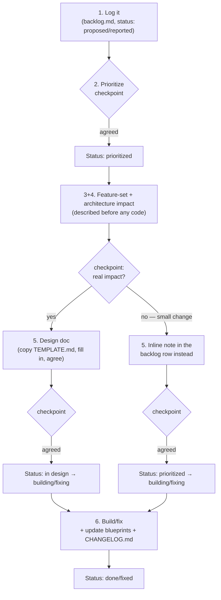

# A governance template for AI-assisted development

This is a reusable extraction of a lightweight documentation-and-checkpoint
process, originally developed inside a real project
([`test-virtual-app-builder`](../test-virtual-app-builder)) as its
`CLAUDE.md` — the file an AI coding agent (or a human contributor) reads
before touching the codebase. It has since been generalized so it can be
dropped into any project.

The rest of this file is the guide: what the structure is, why each piece
exists, and how to adopt it. The other files in this folder
(`CLAUDE.md`, `CHANGELOG.md`, `docs/backlog.md`,
`docs/blueprints/features.md`, `docs/blueprints/architecture.md`,
`docs/blueprints/components/TEMPLATE.md`, `docs/designs/TEMPLATE.md`) are
the actual template — copy them into a new project as-is and start
filling them in.

## The problem this solves

AI coding agents (and, honestly, human contributors moving fast) default
to going straight from "here's a request" to "here's a diff." That's fine
for a one-line fix. It breaks down for anything with real scope, in a few
predictable ways:

- **Docs rot.** Nobody updates the architecture doc when the architecture
  changes, because updating docs isn't part of "doing the task."
- **Scope creep passes unnoticed.** An agent (or a developer) quietly
  expands what a feature does because there was no checkpoint where the
  plan was stated out loud and agreed to.
- **Decisions lose their reasoning.** Six months later nobody remembers
  *why* a component was built the way it was — only what it currently
  does.
- **The roadmap and the current state get tangled together**, so it's
  impossible to tell, from the docs alone, whether something described is
  live today or still aspirational.

This template fixes all four by making documentation and agreement a
mandatory, ordered part of the workflow itself — not a follow-up task
that's easy to skip.

## The five artifacts

| File | Answers | Lifespan |
|------|---------|----------|
| [`CLAUDE.md`](./CLAUDE.md) | "What process do I follow?" | Static — the rules |
| [`docs/backlog.md`](./docs/backlog.md) | "What's requested, and where does it stand?" | Living queue |
| [`docs/blueprints/features.md`](./docs/blueprints/features.md) | "What can the system do *right now*?" | Kept current |
| [`docs/blueprints/architecture.md`](./docs/blueprints/architecture.md) + [`components/`](./docs/blueprints/components/) | "How is it built *right now*?" | Kept current |
| [`docs/designs/<slug>.md`](./docs/designs/TEMPLATE.md) | "What did we agree to build, and why?" | Permanent record, one per feature/bug |
| [`CHANGELOG.md`](./CHANGELOG.md) | "What shipped, and when?" | Append-only history |

The key design choice: **blueprints describe the present, the backlog
describes the future, design docs preserve the past.** Nothing is allowed
to blend those tenses, which is what keeps each file trustworthy on its
own — you never have to cross-reference three docs to figure out if a
described capability actually exists yet.

## The workflow

Both the feature workflow and the bug workflow follow the same six-step
shape, with three mandatory checkpoints where work stops until the human
explicitly agrees:

Why three checkpoints and not zero or six:

- **Too few** (e.g. "just build it") and an agent runs off with an
  under-specified request, producing something technically matching the
  words but not the intent — expensive to unwind after the fact.
- **Too many** (a checkpoint after every sentence) and the process itself
  becomes the bottleneck, and people start rubber-stamping to get through
  it.
- **Three, at the natural decision points** — *should we do this at all
  relative to everything else*, *what will it change*, *exactly how* —
  matches where a reasonable human reviewer would actually want to weigh
  in, and nowhere else.

Note step 3+4 explicitly happens **before any code is written**. The
impact on the user-facing feature set and on the architecture has to be
articulated in plain language first. This is often where an
under-specified request gets caught — it's much cheaper to say "wait,
that doesn't sound right" against two paragraphs of prose than against a
diff.

## The small-change exception

Not every change deserves a permanent design-doc file. A one-line copy
fix or a config default tweak has no real feature-set or architecture
impact — running it through the full step 5 (copy the template, fill in
every section, get it agreed as its own file) is process for its own
sake, and that's exactly the kind of overhead that gets people to start
skipping the workflow altogether, including for changes that *do* need
it.

So if step 3+4 turns up nothing — no feature-set impact, no architecture
impact, confined to one component — step 5 collapses: the summary,
impact, and design get written and agreed as a short inline note directly
in the backlog row instead of a separate file, and the row moves straight
from `prioritized` to `building`/`fixing` (skipping `in design`
entirely). Everything else about the workflow stays intact — it's still
logged, still prioritized, still described and agreed *before* the code
is written, and the backlog row still exists as a locatable (if terse)
record of what happened and why.

The judgment call — "is this actually small?" — is deliberately left to
the checkpoint at step 3+4, not to whoever is making the change. If
there's any doubt, the rule says default to the full design doc; the
exception is meant to relieve pressure on genuinely trivial changes, not
to become the default path that quietly swallows medium-sized ones.

## Why the design doc is separate from the backlog row

The backlog row is a queue entry — terse, and its status changes over
time. The design doc is the actual record of *what was agreed and why*,
and it never changes after the feature ships (except to mark it
`implemented`). Keeping them separate means:

- The backlog stays scannable as a queue (one line per item), instead of
  bloating into a wall of design detail.
- The design doc survives as an artifact you can point to later —
  "why does this work this way?" always has an answer that isn't "check
  the git blame and reverse-engineer the PR discussion."

## Why the changelog update is bundled into "done," not a follow-up

The rule ("update `CHANGELOG.md` and `features.md` in the same turn as
the change, not a separate follow-up") exists because "update the docs
after" is exactly the step that never happens once the code works and
attention has moved on. Bundling it into the definition of *done* is what
actually makes it happen consistently — this is the single highest-
leverage rule in the whole template.

## Adopting this in a new project

1. Copy `CLAUDE.md`, `CHANGELOG.md`, and `docs/` into the new project
   root.
2. Fill in `docs/blueprints/features.md` and `architecture.md` with
   whatever the system's actual starting state is (even "nothing yet" is
   a valid starting snapshot).
3. Seed `docs/backlog.md` with whatever's already known to be coming.
4. If you're using an AI coding agent that reads a system/instructions
   file (Claude Code's `CLAUDE.md`, or equivalent), point it at this file
   — the workflow is written as directives an agent can follow
   mechanically, not just guidance for humans.
5. Adjust freely: the phased-roadmap section in `backlog.md` is optional,
   the "target architecture" section in `architecture.md` is optional,
   and the component-blueprint granularity should match how the project
   is actually decomposed. What shouldn't change is the *shape* — present
   tense in blueprints, future in the backlog, permanent record in
   designs, and the three checkpoints in order.

## What this template deliberately doesn't cover

- **Code review / merge mechanics** — this governs planning and
  documentation discipline, not git workflow.
- **Prioritization method** (RICE, MoSCoW, gut feel) — step 2 just
  requires *that* prioritization happens and is agreed, not a specific
  framework.
- **Design doc depth** — `TEMPLATE.md`'s sections are a floor, not a
  ceiling; scale the "Design" section to the feature's actual complexity.
