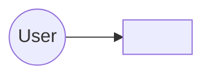

# Architecture Blueprint

High-level shape of the system: what's actually running today, and (if
useful) the target architecture it's being built toward. Per-component
detail lives under [`components/`](./components/); current capabilities
are inventoried in [`features.md`](./features.md).

No roadmap or plan content belongs here — that lives in
[`docs/backlog.md`](../backlog.md). This describes the system as it
stands, kept current as changes land (see [`CLAUDE.md`](../../CLAUDE.md)).

## Current implementation

<Short prose walkthrough of the diagram — what talks to what, and why.>

## Target architecture

<Optional. Only if there's an agreed direction the system is being built
toward that differs from today. Delete this section otherwise.>
